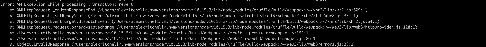

# CrowdSaleTutorial

## 💸 CrowdSaleTutorial

This is a program that creates a token and a crowdsale using Solidity

## 💯 Project facts
* Developed by Alexander Mitchell for Blockchain assignment 3.

## 🏎 Getting up and Running

> You can access this program by cloning the repo to your local machine via SSH.
<!-- -->
❗️**IMPORTANT:**
> The program is not working properly so I cannot show you the output.

### 🤔 How to run
You run the code by either:
1. Install the dependencies
```bash
$ npm install
```

2. Run these three commands in succession
```bash
$ truffle compile
$ truffle development
migrate --reset #Once inside the truffle console
```

## 📝 Homework outputs and what happened

1. So there are no outputs 😢. Why? Errors. 🙃
While going through the tutorial I made quite a bit of progress till it came
to actually executing the function to buy tokens. I kept getting the below error:

* 

After several attempts to alleviate the error I was not able to alleviate the problem.
2. So what did I do to try to solve this issue?
* Searched each Error
* Spoke to the professor and friends
* Reworked the solution several times
